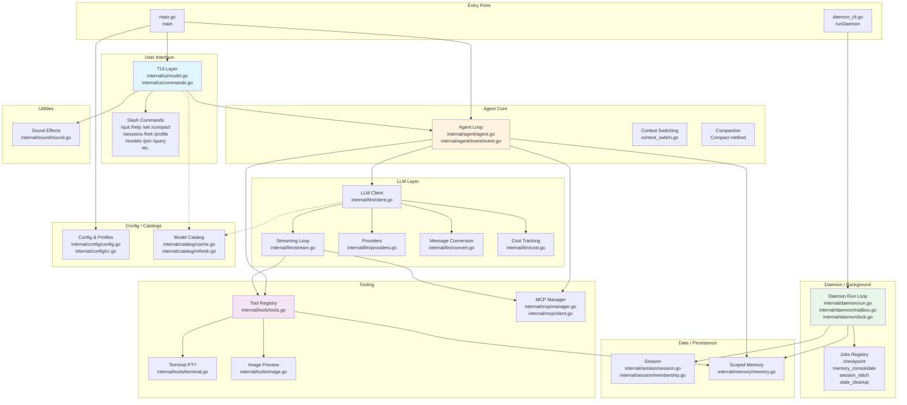

# Pathfinder — Feature Inventory

**Date:** 2026-05-10
**Confidence:** HIGH — directory structure and package boundaries are clear; CLAUDE.md provides authoritative architectural guidance.
**Known gaps:** `internal/agent/agent.go` is 1666 lines and handles multiple concerns (loop, context switching, compaction, memory scope routing); some sub-features (compaction, context switching) are not fully separated at the file level.

---

## Feature List

### 1. Terminal TUI (User Interface)
- **Entry points:** `main.go:273` (`runHeadless`), `internal/ui/model.go:181` (`NewModel`)
- **Core files:** `internal/ui/model.go`, `internal/ui/commands.go`
- **Purpose:** Bubble Tea-based terminal UI handling input, slash-command dispatch, viewport rendering, tool panel, signal handling, and event routing to the agent.

### 2. Agent / LLM Loop
- **Entry points:** `internal/agent/agent.go:129` (`NewAgent`), `internal/agent/agent.go:238` (`SendMessage`)
- **Core files:** `internal/agent/agent.go` (1666 lines), `internal/agent/event/event.go`
- **Purpose:** Orchestrates the streaming conversation loop — streams LLM tokens, emits tool_call events, executes tools via the Registry, feeds results back, maintains per-context message histories, and handles compaction.

### 3. LLM Client / Provider Abstraction
- **Entry points:** `internal/llm/client.go` (`NewClient`), `internal/llm/stream.go:41` (`StreamChat`)
- **Core files:** `internal/llm/client.go`, `internal/llm/stream.go`, `internal/llm/providers.go`, `internal/llm/convert.go`, `internal/llm/cost.go`
- **Purpose:** Wraps fantasy.Provider + LanguageModel with OpenAI-compatible and Anthropic provider paths; handles streaming, retry backoff, message format conversion (fantasy <-> llm), cost tracking, and tool schema plumbing.

### 4. Tool Registry and Execution
- **Entry points:** `internal/tools/tools.go:61` (`NewRegistry`), `internal/tools/tools.go:109` (`Definitions`), `internal/tools/tools.go:487` (`Execute`)
- **Core files:** `internal/tools/tools.go`, `internal/tools/terminal.go`, `internal/tools/image.go`
- **Purpose:** Defines and executes all built-in tools exposed to the LLM: `read`, `write`, `edit`, `bash`, `search_memory`, `write_memory`, `terminal_*` PTY family, and `preview_image`. Manages read-before-edit guards and per-tool timeouts.

### 5. Session Persistence and Management
- **Entry points:** `internal/session/session.go:19` (session.go), `internal/session/session.go:98` (`Load`)
- **Core files:** `internal/session/session.go`, `internal/session/membership.go`
- **Purpose:** JSONL-based append-only session log at `~/.bitchtea/sessions/`; supports resume, list, fork, and tree operations. Channel/membership state tracked separately. Fantasy-native entries with legacy v0 fallback reader.

### 6. Scoped Memory Management
- **Entry points:** `internal/memory/memory.go:57` (`Load`), `internal/memory/memory.go` (Save)
- **Core files:** `internal/memory/memory.go`
- **Purpose:** Provides RootScope/ChannelScope/QueryScope memory stores keyed by workspace; daily append files for compacted history; consumed by `search_memory` tool and agent compaction.

### 7. Background Daemon and Jobs
- **Entry points:** `daemon_cli.go:33` (`runDaemon`), `internal/daemon/run.go:43` (`Run`), `internal/daemon/jobs/checkpoint.go:49` (`handleSessionCheckpoint`)
- **Core files:** `internal/daemon/run.go`, `internal/daemon/mailbox.go`, `internal/daemon/lock.go`, `internal/daemon/jobs/checkpoint.go`, `internal/daemon/jobs/memory_consolidate.go`, `internal/daemon/jobs/session_stitch.go`, `internal/daemon/jobs/stale_cleanup.go`
- **Purpose:** In-process daemon run loop with file-based mailbox IPC, lock/pidfile management, and a jobs registry handling session checkpointing, memory consolidation, session stitching, and stale file cleanup. Triggered via `bitchtea daemon start`.

### 8. MCP (Model Context Protocol) Integration
- **Entry points:** `internal/mcp/manager.go` (`NewManager`), `internal/mcp/client.go` (Server)
- **Core files:** `internal/mcp/manager.go`, `internal/mcp/client.go`, `internal/mcp/config.go`
- **Purpose:** Manages lifecycle of MCP stdio servers; exposes namespaced tools (`mcp__<server>__<tool>`) to the LLM; per-server start timeouts, health state tracking, and tools cache with TTL.

### 9. Model Catalog and Pricing
- **Entry points:** `internal/catalog/cache.go` (`Load`), `main.go:60` (`SetDefaultPriceSource`)
- **Core files:** `internal/catalog/cache.go`, `internal/catalog/load.go`, `internal/catalog/refresh.go`
- **Purpose:** Bounded, cache-backed refresh path for the catwalk model catalog (`~/.bitchtea/catalog/providers.json`); used for model picker UI and as the default price source for cost tracking.

### 10. Configuration and Profiles
- **Entry points:** `internal/config/config.go:84` (`DefaultConfig`), `internal/config/config.go:121` (`DetectProvider`), `internal/config/rc.go:ParseRC`
- **Core files:** `internal/config/config.go`, `internal/config/rc.go`
- **Purpose:** Manages config struct, environment-variable provider detection, `~/.bitchtearc` parsing, profile save/load/delete for built-in profiles (`ollama`, `openrouter`, `zai-openai`, `zai-anthropic`) and user-saved profiles.

### 11. Sound / Notification Effects
- **Entry points:** `internal/sound/sound.go:12` (`Play`), `internal/sound/sound.go:28` (`Beep`)
- **Core files:** `internal/sound/sound.go`
- **Purpose:** Terminal bell (`\a`) based notification sounds for agent done/success/error states; overridable `Output` writer for tests.

### 12. TUI Commands (Slash Commands)
- **Entry point:** `internal/ui/commands.go:34` (`slashCommandRegistry`)
- **Core files:** `internal/ui/commands.go`
- **Purpose:** Registers and dispatches all slash commands: `/quit`, `/help`, `/set`, `/clear`, `/restart`, `/compact`, `/copy`, `/tokens`, `/status`, `/save`, `/debug`, `/activity`, `/mp3`, `/theme`, `/memory`, `/sessions`, `/resume`, `/tree`, `/fork`, `/profile`, `/models`, `/join`, `/part`, `/query`, `/channels`, `/msg`. Delegates to handler functions on `Model`.

---

## Feature Boundary Diagram

