# Flowchart: MCP (Model Context Protocol) Integration

```mermaid
flowchart TD
    subgraph manager_go["internal/mcp/manager.go"]
        NewManager["NewManager(cfg, auth, audit)\nmanager.go:109"] --> Start["Manager.Start(ctx)\nmanager.go:148"]
        
        Start --> EnabledCheck["if !m.cfg.Enabled\nreturn nil\nmanager.go:149-151"]
        EnabledCheck --> ParallelSpawn["for each sc in cfg.Servers\nparallel goroutines\nmanager.go:156-179"]
        
        ParallelSpawn --> NewServerCall["newServer(sc)\n→ NewServer(cfg)\nclient.go:111"]
        NewServerCall --> TransportSwitch{"switch cfg.Transport\nclient.go:112-119"}
        
        TransportSwitch -->|"stdio"| StdioStart["stdioServer.Start(ctx)\nclient.go:336"]
        TransportSwitch -->|"http"| HTTPStart["httpServer.Start(ctx)\nclient.go:369"]
        
        StdioStart --> StdioCmd["exec.CommandContext(ctx, cmd, args)\n+ mergeEnv(extra)\nclient.go:345-346"]
        StdioCmd --> SDKConnectStdio["mcpsdk.NewClient()\nclient.Connect(ctx, CommandTransport)\nclient.go:348-349"]
        
        HTTPStart --> HTTPClient["http.Client + headerRoundTripper\nclient.go:378-381"]
        HTTPClient --> SDKConnectHTTP["mcpsdk.NewClient()\nclient.Connect(ctx, StreamableClientTransport)\nclient.go:386-387"]
        
        SDKConnectStdio --> MarkRunning["markRunning(name, srv)\nmanager.go:178,195"]
        SDKConnectHTTP --> MarkRunning
        
        ParallelSpawn -->|"any start error"| MarkUnhealthy["markUnhealthy(name, srv, reason)\nmanager.go:160,175,201"]
        
        MarkRunning --> Servers["Manager.Servers()\nreturns running servers\nmanager.go:262"]
    end
    
    subgraph discovery["Tool Discovery: ListAllTools"]
        ListAllTools["Manager.ListAllTools(ctx)\nmanager.go:304"] --> TryCache["tryReadCache()\nTTL cache check\nmanager.go:348"]
        
        TryCache -->|"cache hit"| ReturnCache["return cached\nNamespacedTool[]\nmanager.go:306"]
        TryCache -->|"cache miss"| GetServers["m.Servers()\nmanager.go:309"]
        
        GetServers --> LoopServers["for each srv in servers\nmanager.go:314"]
        LoopServers --> ListToolsSDK["srv.ListTools(ctx)\n→ baseServer.ListTools()\nclient.go:160"]
        
        ListToolsSDK --> ValidCheck["validToolName(t.Name)\n[A-Za-z0-9_]\nmanager.go:321,548"]
        ValidCheck -->|"invalid"| SkipTool["log error, skip tool\nmanager.go:325"]
        ValidCheck -->|"valid"| Namespace["NamespacedTool{\n  Server: srv.Name(),\n  Tool: t,\n  Name: mcp__<server>__<tool>\n}\nmanager.go:328-332"]
        
        Namespace --> AppendOut["append to out slice"]
        LoopServers -->|"next server"| ListToolsSDK
        
        AppendOut --> StoreCache["storeCache(out)\nmanager.go:341\n(only if errs==nil)"]
        StoreCache --> ReturnTools["return out, joined errors\nmanager.go:343"]
    end
    
    subgraph call["Tool Call Dispatch: CallTool"]
        CallTool["Manager.CallTool(ctx,\n  namespacedName, args)\nmanager.go:397"] --> Split["SplitNamespacedName(name)\nmanager.go:398,534"]
        
        Split --> ParseResult{"parse result\n(server, tool, ok)"}
        ParseResult -->|"invalid format"| ErrBadName["return error\nmanager.go:400"]
        ParseResult -->|"valid"| LookupSrv["m.lookupServer(server)\nmanager.go:402,509"]
        
        LookupSrv --> SrvFound{"srv != nil\n&& state==stateRunning"}
        SrvFound -->|"not found"| ErrSrvNotRunning["return error\nmanager.go:404"]
        SrvFound -->|"found"| Authorize["m.auth.Authorize(ctx,\nserver, tool, args)\nmanager.go:407"]
        
        Authorize -->|"denied"| ErrAuth["return error\nto caller\nmanager.go:408-409"]
        Authorize -->|"allowed"| AuditStart["m.audit.OnToolStart(\nToolCallStart{...})\nmanager.go:412-417"]
        
        AuditStart --> CallToolSDK["srv.CallTool(ctx, tool, args)\n→ baseServer.CallTool()\nclient.go:183,419"]
        
        CallToolSDK --> SDKCall["s.CallTool(ctx,\n  &mcpsdk.CallToolParams)\nclient.go:196"]
        SDKCall --> resultFromSDK["resultFromSDK(res)\nclient.go:308"]
        
        resultFromSDK --> AuditEnd["m.audit.OnToolEnd(\nToolCallEnd{...})\nmanager.go:421-434"]
        AuditEnd --> ReturnResult["return res, err\nmanager.go:436"]
    end
    
    subgraph health["Health Tracking & TTL Cache"]
        HealthEntry["entry{\n  server,\n  state: running|unhealthy,\n  reason\n}\nmanager.go:58-62"]
        
        markRunning["state = stateRunning\nmanager.go:195-199"]
        markUnhealthy["state = stateUnhealthy\nmanager.go:201-205"]
        
        TTL["ToolsCacheTTL\ndefault 60s\nmanager.go:33"]
        
        tryReadCache["time.Since(cachedAt)\n> ToolsCacheTTL?\nmanager.go:357"]
        
        Invalidate["InvalidateToolsCache()\nmanager.go:382-387\n(sets cachedTools=nil)"]
    end
    
    subgraph config_loading["Config & Security"]
        LoadConfig["LoadConfig(workDir)\nconfig.go:119"]
        
        FileCheck{"mcp.json exists?\nconfig.go:121"}
        FileCheck -->|"no"| ReturnDisabled["Disabled()\nconfig.go:125"]
        
        FileCheck -->|"yes"| TopLevelEnabled{"top-level\nenabled: true?\nconfig.go:137"}
        TopLevelEnabled -->|"no"| ReturnDisabled
        
        TopLevelEnabled -->|"yes"| ServerLoop["for each server:\nper-server enabled?\nconfig.go:144-151"]
        
        ServerLoop -->|"disabled"| Skip
        ServerLoop -->|"enabled"| EnvResolve["resolveString()\n${env:VARNAME}\nconfig.go:230-256"]
        
        EnvResolve --> SecretScan["looksLikeInlineSecret()\nrejects sk-*, ghp_*, etc\nconfig.go:248-254"]
        SecretScan -->|"inline secret"| ReturnDisabled
    end
    
    subgraph external["External Dependencies"]
        Ext1["github.com/modelcontextprotocol/go-sdk/mcp\n(mcpsdk)"]
        Ext2["os/exec\n(stdio transport)"]
        Ext3["net/http\n(http transport)"]
    end

    style NewManager fill:#e1f5fe
    style ListAllTools fill:#f3e5f5
    style CallTool fill:#fff3e0
    style LoadConfig fill:#e8f5e8
    style Servers fill:#fce4ec
```

## Summary

**MCP Server Startup:** `NewManager` → `Manager.Start` launches each server in parallel goroutines. stdio path: `exec.CommandContext` → `mcpsdk.CommandTransport`. HTTP path: `http.Client` with auth header injection → `mcpsdk.StreamableClientTransport`. Successful servers marked `stateRunning`; failures marked `stateUnhealthy`.

**Tool Discovery:** `ListAllTools` uses a 60s TTL cache. On miss, calls each running server's `ListTools`, validates names (alphanumeric + underscore only), wraps as `mcp__<server>__<tool>`, caches only if all servers succeed.

**Tool Call Dispatch:** `CallTool` parses namespaced name → validates server exists and is running → `Authorize` → `audit.OnToolStart` → `srv.CallTool` → `resultFromSDK` → `audit.OnToolEnd` → return.

**Health Tracking:** Per-server state in `entries map`, TTL cache with its own mutex separate from lifecycle mutex. `InvalidateToolsCache()` clears cache on tools/list_changed or post-restart.

**Security:** Inline secrets (sk-*, ghp_*) rejected at config load time; secret values must come from env vars via `${env:VAR}`.

**External dependencies:** modelcontextprotocol/go-sdk (mcpsdk), os/exec, net/http
