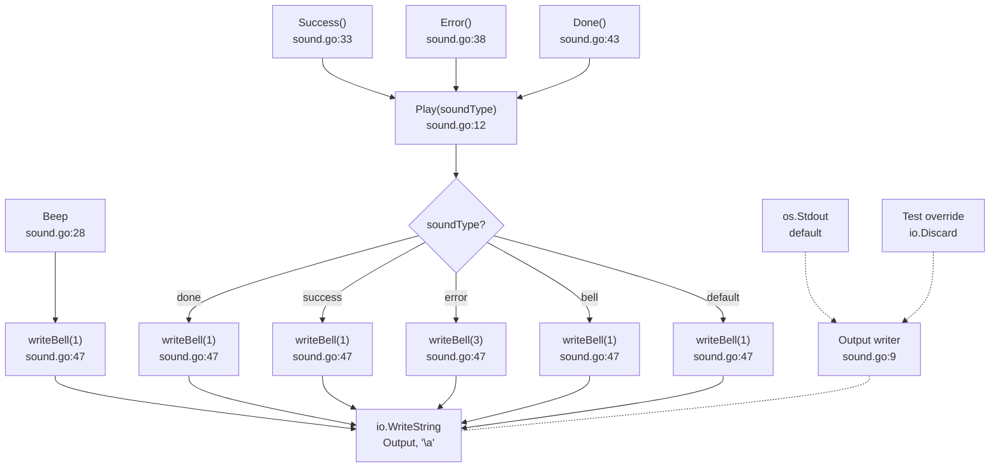

# Flowchart: Sound / Notification Effects

## Summary

`Beep()` is a direct single-bell emitter. `Play(soundType)` dispatches: `"error"` emits 3 bells, all others emit 1. Convenience wrappers `Success()`, `Error()`, `Done()` delegate to `Play`. Every path writes `\a` to the package-level `Output io.Writer` (default `os.Stdout`). Errors from `io.WriteString` are silently discarded. Fire-and-forget notification system with no returned errors or retry logic.

**External dependencies:** `io`, `os`
