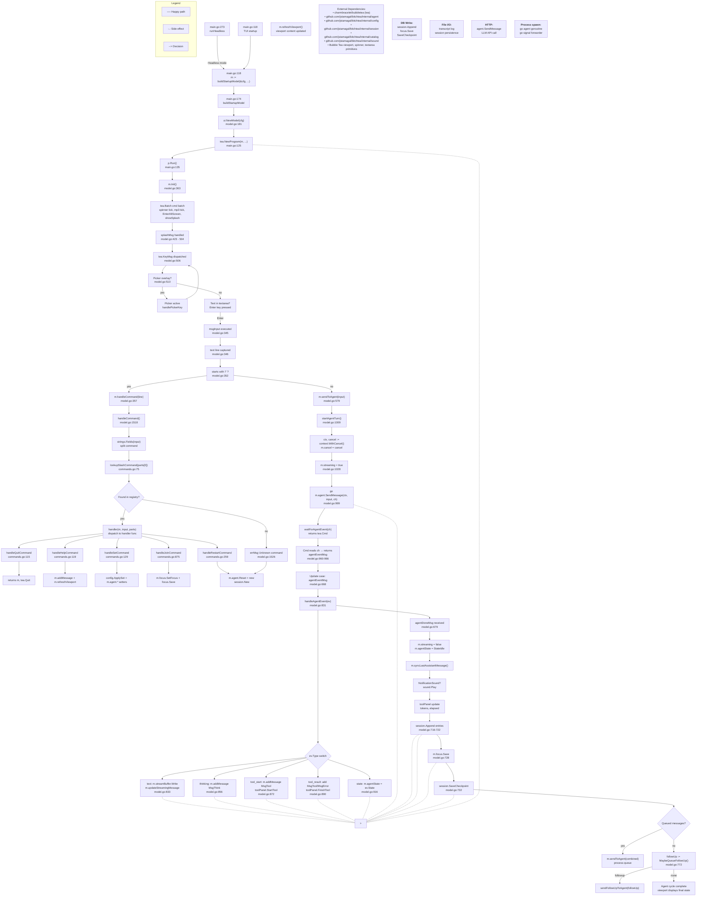

# Flowchart: Terminal TUI (User Interface)

## Summary

**Startup** (`main.go:118` → `NewModel` → `tea.Program` → `Init`): `NewModel` wires agent, focus manager, session, transcript logger. `Init` returns splash screen command batch.

**Input routing**: `tea.KeyMsg` → `Update` → textarea Enter → `msgInput` → `/` prefix test → `handleCommand` or `sendToAgent`.

**Slash command dispatch**: `handleCommand` at `model.go:1518` splits input, looks up `parts[0]` in registry (~27 commands), dispatches to handler.

**Agent event loop**: `startAgentTurn` → goroutine `agent.SendMessage` → `waitForAgentEvent` → `handleAgentEvent`. Text streaming writes in-place to last `MsgAgent`. Tool events add `MsgTool` entries. On done: stop streaming, persist session, drain queue, send follow-up.

**Side effects:** session append, focus save, checkpoint save, transcript logging, LLM API calls.

**External dependencies:** bubbletea, internal/agent, internal/config, internal/session, internal/catalog, internal/sound
